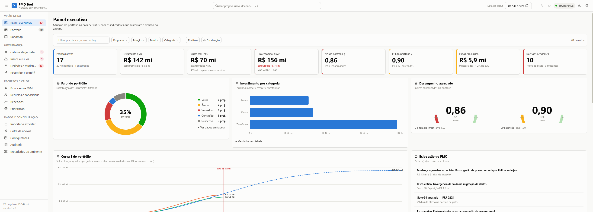
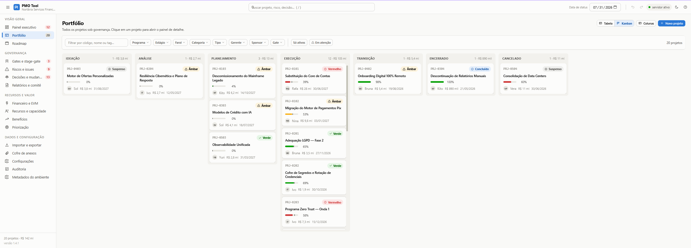
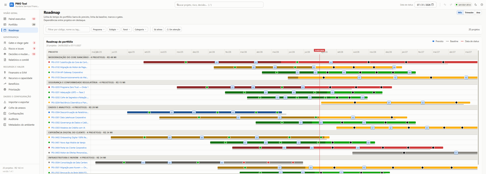
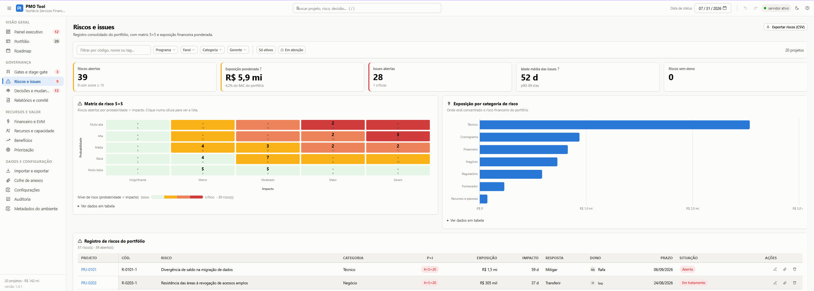
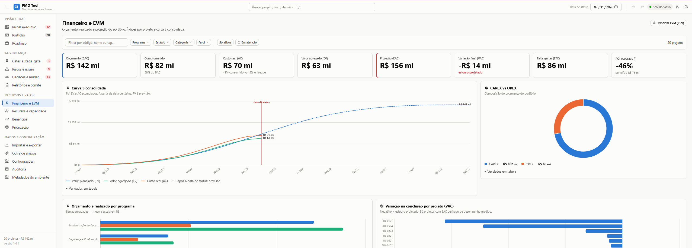
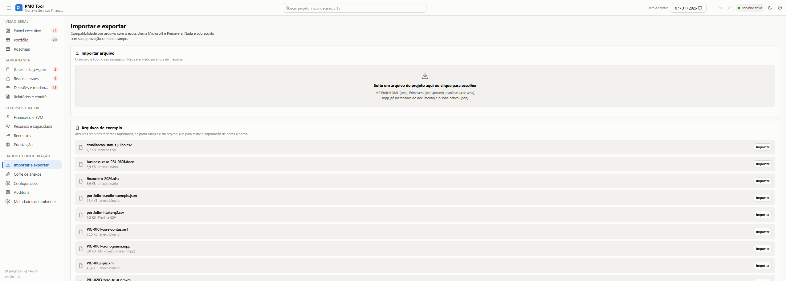

<div align="center">

# PMO Tool

**Governança de portfólio que roda na sua máquina — e não manda seus projetos para lugar nenhum.**

Para PMO Leads que precisam consolidar projetos, acompanhar saúde, riscos, prazo e custo,
e chegar ao comitê com evidência em vez de planilha remendada.

[Instalar](#instalar) ·
[O que você vê](#o-que-você-vê) ·
[Relatórios por público](#relatórios-por-público) ·
[Seus dados](#seus-dados-ficam-na-sua-máquina) ·
[Documentação](#documentação)

[](https://github.com/pdgusta/pmo-tool/releases/latest)


[](https://github.com/pdgusta/pmo-tool/actions/workflows/release.yml)
[](LICENSE)

</div>



## Instalar

Baixe **apenas** o `pmo-instalar.ps1` da
[última release](https://github.com/pdgusta/pmo-tool/releases/latest) e execute:

```powershell
powershell -NoProfile -ExecutionPolicy Bypass -File .\pmo-instalar.ps1 -Repositorio "pdgusta/pmo-tool"
```

Depois, para abrir:

```powershell
.\pmo.ps1
```

A instalação vai para `%LOCALAPPDATA%\PMO-Tool` e a interface abre em `http://localhost:8090`.

O instalador confere o SHA-256 de cada arquivo baixado contra o valor que o GitHub publica, monta
tudo em área temporária e só move para o destino quando passa. Se algo falhar antes disso, nada é
gravado. Ao final ele roda um diagnóstico da instalação.

**Requisitos:** Windows com PowerShell 5.1+, uma pasta local em volume NTFS e a porta `8090` livre.
Nenhum runtime adicional — sem Node, npm, Python ou .NET SDK.

<details>
<summary>Se o Windows bloquear o arquivo, ou se a máquina não alcançar o GitHub</summary>

<br>

Arquivo baixado vem com Mark-of-the-Web. Libere explicitamente:

```powershell
Unblock-File -LiteralPath .\pmo-instalar.ps1
```

Se a política de execução for imposta por GPO como `AllSigned`, o instalador não roda e é preciso
falar com quem administra a política — o projeto não assina código.

Quando a máquina de destino não alcança o GitHub, prepare a instalação em outra máquina, a partir
do código-fonte, e copie a pasta inteira:

```powershell
powershell -NoProfile -ExecutionPolicy Bypass -File .\tools\New-PortableInstall.ps1 `
  -Destination "C:\PMO-Tool" -Repository "pdgusta/pmo-tool"
```

O resultado é idêntico ao do instalador: mesmo layout, mesmo inventário. O destino precisa ser uma
pasta nova ou vazia e, por padrão, **nenhum dado da máquina de origem é copiado**.

O procedimento completo, com os pré-requisitos a verificar antes, está em
[Instalar em uma máquina nova](docs/context/runbooks/instalar-maquina-nova.md).

</details>

## O que ele resolve

Informação de portfólio costuma viver espalhada: o cronograma no MS Project, o orçamento numa
planilha, os riscos numa segunda planilha, as decisões do comitê numa ata que ninguém reabre. Na
véspera da reunião, alguém monta tudo à mão — e o que chega ao sponsor é uma foto sem rastro.

O PMO Tool reúne isso em uma base só e trabalha na **camada de decisão**: saúde do portfólio,
exceções, gates, riscos, valor, capacidade e dinheiro. O farol não é digitado por ninguém — ele
emerge do cálculo e vem acompanhado dos motivos.

**O que ele não é:** uma ferramenta de cronograma. O detalhe de planejamento continua na ferramenta
de origem e entra aqui por importação, com reconciliação campo a campo.

## O que você vê

### Painel executivo

Onde a liderança precisa agir, antes de a reunião começar: orçamento, custo real, projeção final,
SPI, CPI e exposição a risco, com a curva S do portfólio e a fila do que exige decisão do PMO.

### Portfólio

A mesma informação em tabela configurável, para análise, ou em kanban por estágio, para acompanhar
o fluxo.



### Roadmap

O plano no tempo, com baseline, marcos, gates e as dependências que atravessam projetos e
programas — que é onde os atrasos costumam nascer.



### Gates e stage-gate

Onde o portfólio está parado: funil de gates G0 a G5, decisões aguardando o comitê, aprovações
condicionais em aberto e atrasos de decisão.

> **[ CAPTURA PENDENTE ]** `docs/images/readme/gates-stage-gate.png`
> Tela: **Gates e stage-gate** — `http://localhost:8090/#gates`

### Riscos e issues

Exposição priorizada em matriz 5×5 e registro consolidado, com responsável e resposta — não uma
lista que só cresce.



### Financeiro e valor agregado

Orçamento, comprometido, custo real e valor agregado, com projeção final (EAC), variação na
conclusão (VAC), ETC e composição CAPEX/OPEX. Índices de EVM sem significância estatística são
marcados como tal e **não** alimentam o farol nem a projeção.



### Importação sob controle

MS Project XML, Primavera XER e PMXML, planilhas CSV e XLSX, bundle nativo — e `.mpp` só para os
metadados do documento. O arquivo é lido **dentro do seu navegador**: nada é enviado para fora da
máquina. Nenhum campo é sobrescrito sem a sua aprovação, campo a campo.



## Relatórios por público

O mesmo projeto rende quatro documentos diferentes, porque quatro públicos precisam de coisas
diferentes — e alguns não podem ver tudo.

> **[ CAPTURA PENDENTE ]** `docs/images/readme/relatorios-por-publico.png`
> Tela: **Relatórios e comitê** — `http://localhost:8090/#relatorios` — deixar o seletor de público visível

| Variante | Público | O que sai |
|---|---|---|
| **Interno** | PMO, gerência do projeto e time | Tudo que se aplica, inclusive itens restritos. |
| **Executivo** | Sponsor e steering committee | Farol, EVM essencial, pedidos ao comitê e próximo gate. O status report cabe em uma folha A4. |
| **Auditoria** | Auditoria interna e compliance | Trilha de decisões, gates com datas e aprovadores, mudanças e baseline. Sem narrativa subjetiva. |
| **Externo** | Cliente, fornecedor ou parceiro | Escopo, marcos e avanço. Sem riscos e sem exposição financeira. |

Riscos, issues e decisões podem ser marcados como **restritos**. Nas variantes externo e executivo
eles não aparecem em lugar nenhum do documento — e o próprio documento declara **quantos itens
ficaram de fora**, para que a omissão seja visível em vez de silenciosa.

Status report e pacote de comitê saem em HTML autocontido, prontos para imprimir ou virar PDF.

## Seus dados ficam na sua máquina

O portfólio é gravado no IndexedDB do navegador e replicado em disco, em `data/`. Nada é enviado
para a nuvem: o acesso ao GitHub serve só para consultar e baixar releases.

`data/`, `config/` e `state/` não pertencem ao runtime de uma versão e **não são substituídos numa
atualização**. Se a gravação em disco falhar, você é avisado na interface — o aplicativo não
degrada em silêncio.

Máquinas diferentes não sincronizam entre si. Atualizar o aplicativo não move portfólio.

Detalhes em [Operação e dados](docs/guia/operacao-e-dados.md).

## Atualizar

```powershell
.\pmo.ps1 -Diagnostico
.\pmo.ps1 -Atualizar
```

A atualização exige consentimento. Antes de ativar a nova versão, o PMO Tool conclui a gravação
pendente, verifica os anexos um a um, cria um snapshot completo e valida seu inventário; só então
baixa o runtime, instala **lado a lado** e roda os health checks. O ponteiro da versão ativa é a
última coisa a mudar.

Qualquer falha interrompe o processo sem ativar nada — *fail closed*. A versão anterior e os dados
continuam intactos. O roteiro operacional está em
[Atualizar a máquina B](docs/context/runbooks/atualizar-maquina-b.md).

## Limitações conhecidas

- **Um usuário, uma instalação.** Sem colaboração simultânea, sem autenticação e sem servidor
  compartilhado. Duas instalações do mesmo usuário dividem o armazenamento do navegador, e a
  segunda abre em somente leitura.
- **`.mpp` entrega só metadados do documento** — título, autor, empresa, datas. Para trazer o
  cronograma, exporte como MSPDI/XML.
- **Sem integração autenticada com Microsoft 365.** A interoperabilidade acontece por arquivos e
  por links que você cola.
- **Sem assinatura de código.** A confiança vem do HTTPS do GitHub, da release imutável e da
  conferência de SHA-256 de cada arquivo baixado.
- **Porta `8090` fixa.** Ocupada, a aplicação interrompe a inicialização em vez de mudar a origem —
  outra origem seria outro banco, e os dados pareceriam ter sumido.
- **OneDrive, SharePoint, pastas de rede e mídias removíveis** não são locais de instalação
  suportados.

## Primeiros passos

1. Abra pelo `pmo.ps1`.
2. Na primeira execução, escolha explorar os dados de demonstração, importar seus projetos ou
   começar do zero.
3. Configure organização, data de status, pessoas e programas.
4. Importe seus arquivos e revise o diff de reconciliação antes de confirmar.
5. Confira o painel executivo e os alertas de governança.
6. Gere os relatórios conforme o público que vai recebê-los.
7. Para descartar a demonstração, use **Configurações → Limpar portfólio**.

## Documentação

| | |
|---|---|
| [Importar e exportar](docs/guia/importar-e-exportar.md) | Formatos aceitos, reconciliação e saídas |
| [Operação e dados](docs/guia/operacao-e-dados.md) | Onde os dados ficam, diagnóstico, rollback e restauração |
| [Instalar em uma máquina nova](docs/context/runbooks/instalar-maquina-nova.md) | Runbook de instalação, com pré-requisitos |
| [Atualizar a máquina B](docs/context/runbooks/atualizar-maquina-b.md) | Runbook de atualização |
| [Rollback e restauração](docs/context/runbooks/rollback-restauracao.md) | Runbook de reversão |
| [Tratar incidente](docs/context/runbooks/incidente-maquina-b.md) | Runbook de incidente |
| [Contexto técnico](docs/context/README.md) | Arquitetura, persistência, importação, releases |

## Suporte

- [Releases e histórico de versões](https://github.com/pdgusta/pmo-tool/releases)
- [Bugs, dúvidas e sugestões](https://github.com/pdgusta/pmo-tool/issues) — ao relatar um incidente,
  não publique portfólio, anexos ou outros dados confidenciais.

## Direitos e licença

Copyright © 2026. Todos os direitos reservados.

O código é publicamente visível para inspeção e distribuição de releases autorizadas, mas isso não
concede uma licença de código aberto nem permissão para usar, copiar, modificar ou redistribuir o
software fora dos termos autorizados. Consulte [LICENSE](LICENSE) e [NOTICE](NOTICE) para os termos
completos. O software é fornecido "no estado em que se encontra", sem garantias.
